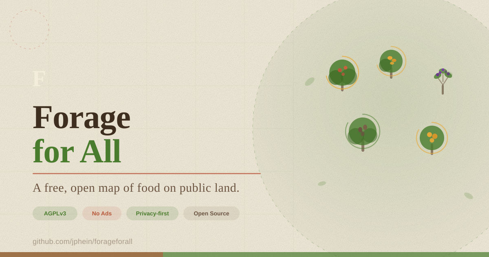

<div align="center">

# 🌿 Forage for All

**A free, open-source map of fruit trees and edible plants growing on public land.**

Drop a pin. Share what's ripe. Eat from your own neighborhood.

[](https://www.gnu.org/licenses/agpl-3.0)
[](https://expo.dev)
[](https://instantdb.com)
[](./CONTRIBUTING.md)
[](#install)

[**Website**](https://forage-for-all.github.io/app) · [**Docs**](./docs) · [**Roadmap**](https://github.com/forage-for-all/app/projects) · [**Discord**](#) · [**Ethics**](./FORAGING_ETHICS.md)



</div>

---

## What this is

A community-run map of fruit trees, berries, nuts, greens, and other edible plants growing on **public land** — street trees, parks, abandoned lots, trailsides, shared fencelines. Pins have photos, species, seasonality, and a **ripeness ring** that fills as the season progresses and other people confirm.

No ads. No analytics. No selling your location. Ever.

## Why it exists

Billions of pounds of fruit fall to sidewalks every year while people buy the same fruit shipped in from other continents. This app tries — modestly — to change that by making the food that's already growing around us **visible**.

## Our four promises

| | |
|---|---|
| 💚 **Free forever** | No ads, no subscriptions, no paywalls. |
| 🔒 **Your data stays yours** | Fuzzy locations by default. Anonymous reports allowed. No trackers. |
| 🌱 **Open source** | AGPLv3. Read it, fork it, break it. |
| 🤝 **Volunteer-run** | Built by foragers, for foragers. |

---

## Install

**Users:** iOS + Android coming to the stores. Join the waitlist at [forageforall.org](#), or build from source below.

**Developers:** 15 minutes from clone to running simulator.

```bash
git clone https://github.com/forage-for-all/app
cd app
npm install
cp .env.example .env   # fill in INSTANT_APP_ID + Google Maps keys
npm run schema:push
npm run seed:species
npx expo prebuild --clean
npm run ios            # or: npm run android
```

Full setup in [`docs/SETUP.md`](./docs/SETUP.md).

---

## Stack

- **[Expo](https://expo.dev)** (React Native) — cross-platform, over-the-air updates
- **[Expo Router](https://docs.expo.dev/router/introduction/)** — file-based navigation
- **[InstantDB](https://instantdb.com)** — realtime sync, auth, permissions
- **[react-native-maps](https://github.com/react-native-maps/react-native-maps)** + Google Maps SDK
- **[Zustand](https://github.com/pmndrs/zustand)** — local state
- **TypeScript** throughout

See [`docs/ARCHITECTURE.md`](./docs/ARCHITECTURE.md) for the full picture.

---

## Project structure

```
forage-app/
├── app/                    # Expo Router screens
│   ├── (tabs)/             # Map, Browse, Calendar, Profile
│   ├── listing/[id].tsx    # Pin detail
│   ├── add/                # Add-listing flow
│   └── onboarding.tsx
├── components/             # Pin, RipenessRing, SeasonStrip, Chip, etc.
├── lib/
│   ├── instant.ts          # InstantDB client + hooks
│   ├── geo.ts              # Geohash + viewport queries
│   ├── ripeness.ts         # Time-weighted ripeness math
│   └── maps.ts             # Custom Google Maps styles
├── theme/                  # Design tokens (colors, type, spacing)
├── scripts/
│   ├── seed-species.ts     # ~60 common edibles seed
│   └── push-schema.ts      # Instant schema sync
├── docs/                   # GitHub Pages site
└── instant.schema.ts       # Source of truth for the DB
```

---

## Contribute

We especially need:

- 🌳 **Botanists & regional foragers** — species data, toxicity warnings, look-alike flags
- 🌍 **Translators** — Spanish, French, German, Portuguese, Mandarin first
- 📱 **Mobile devs** — iOS / Android polish, offline-first improvements
- 🎨 **Designers** — illustrations for species silhouettes (paper-print style)
- 🛡️ **Moderators** — regional pin review, abuse handling

**Before you open a PR**, read:
1. [`CONTRIBUTING.md`](./CONTRIBUTING.md) — setup, code style, PR flow
2. [`FORAGING_ETHICS.md`](./FORAGING_ETHICS.md) — the community code
3. [`CODE_OF_CONDUCT.md`](./CODE_OF_CONDUCT.md)

First-timers: check issues tagged [`good first issue`](https://github.com/forage-for-all/app/labels/good%20first%20issue).

---

## Foraging ethics (tl;dr)

> **Take a third, leave a third for the birds, leave a third for the earth.**

- Only pin on **public land** or with explicit permission.
- Never reveal sensitive species (rare mushrooms, etc.) — moderators blocklist these.
- Flag roadside / industrial-adjacent finds with contamination warnings.
- Confirm species with a reliable source before adding it to the catalog.
- If you wouldn't want *your* tree mapped, don't map someone else's.

Full doc: [`FORAGING_ETHICS.md`](./FORAGING_ETHICS.md).

---

## License

**[GNU AGPLv3](./LICENSE)** — you can use, modify, and redistribute, but:

- Modified versions must **share their source**.
- This includes **hosted services** — you can't run a closed SaaS on this code.

This is intentional. Community-contributed data shouldn't end up behind someone else's paywall.

---

## Credits

- Species data: **[GBIF](https://gbif.org)**, **[iNaturalist](https://inaturalist.org)**, USDA PLANTS
- Base maps: **Google Maps Platform** (custom styled — see [`lib/maps.ts`](./lib/maps.ts))
- Typography: **[Fraunces](https://fonts.google.com/specimen/Fraunces)** (display), **[Inter](https://rsms.me/inter/)** (UI)
- Inspired by [Falling Fruit](https://fallingfruit.org), [iNaturalist](https://inaturalist.org), and every neighbor who's ever handed a stranger a bag of lemons.

---

<div align="center">

*"Eating is an agricultural act." — Wendell Berry*

Made with 🫐 by volunteers. [Join us.](./CONTRIBUTING.md)

</div>
